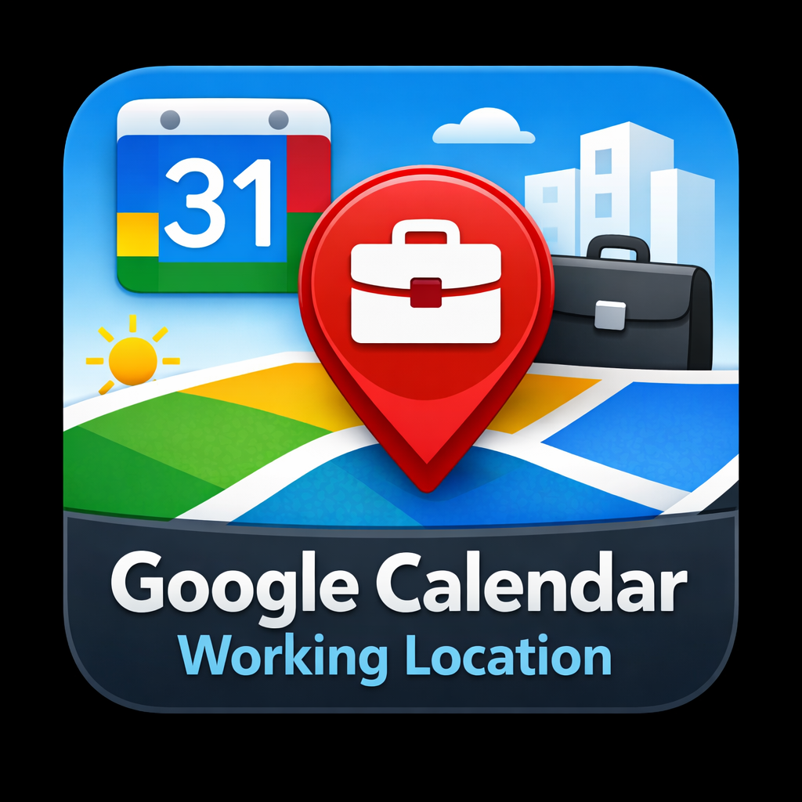

# Google Calendar Working Location

A Home Assistant custom integration that exposes your **Google Calendar working location** as a sensor. When you set your working location in Google Calendar (Home, Office, or a custom location), this integration reflects it in real time.

## Features

- `sensor.working_location` with states: `homeOffice`, `officeLocation`, `customLocation`, `none`, `unknown`
- `calendar.working_location` — shows working location events on the HA Calendar card
- Detailed attributes mirroring Google's `workingLocationProperties` (building ID, floor, desk, custom label, etc.)
- Automatic token refresh via Home Assistant's OAuth2 helpers — no manual re-authentication
- Configurable calendar ID, polling interval, and "none outside working hours" behaviour
- HACS-compatible

## Requirements

- Home Assistant 2024.1 or later
- A Google Cloud project with the **Google Calendar API** enabled
- OAuth 2.0 client credentials (client ID + secret) for a Web Application

## Installation

### Via HACS (recommended)

1. In HACS, go to **Integrations → Custom repositories**.
2. Add `https://github.com/RyanGWU82/ha-working-location` as an **Integration**.
3. Install **Google Calendar Working Location** from the HACS store.
4. Restart Home Assistant.

### Manual

1. Copy the `custom_components/working_location/` directory into your HA `config/custom_components/` folder.
2. Restart Home Assistant.

## Setup

### 1 — Create Google OAuth credentials

1. Go to the [Google Cloud Console](https://console.cloud.google.com/).
2. Enable the **Google Calendar API** for your project.
3. Create an **OAuth 2.0 Client ID** (type: *Web application*).
4. Add `https://<your-ha-url>/auth/external/callback` to the list of **Authorised redirect URIs**.
5. Note the **Client ID** and **Client Secret**.

### 2 — Add Application Credentials in Home Assistant

1. Go to **Settings → Application Credentials**.
2. Click **Add Application Credential**.
3. Select **Google Calendar Working Location** as the integration.
4. Paste your Client ID and Client Secret, then save.

### 3 — Add the integration

1. Go to **Settings → Devices & Services → Add Integration**.
2. Search for **Google Calendar Working Location**.
3. Follow the OAuth flow to grant calendar read access.

## Configuration options

After setup, click **Configure** on the integration card to adjust:

| Option | Default | Description |
|---|---|---|
| Calendar ID | `primary` | Google Calendar ID to read from. Use `primary` for your main calendar. |
| Update interval | `5` minutes | How often to poll Google Calendar (minimum 1 minute). |
| Return `none` outside working hours | `false` | When enabled, the sensor returns `none` if no event covers the current time (useful evenings/weekends). |

## Sensor

### State

| Value | Meaning |
|---|---|
| `homeOffice` | Working from home |
| `officeLocation` | Working from an office |
| `customLocation` | Working from a custom location |
| `none` | No working location set for today |
| `unknown` | API returned an unexpected event shape |

### Attributes

| Attribute | Source |
|---|---|
| `type` | `workingLocationProperties.type` |
| `homeOffice` | `workingLocationProperties.homeOffice` (raw value) |
| `customLocation_label` | `workingLocationProperties.customLocation.label` |
| `officeLocation_buildingId` | `workingLocationProperties.officeLocation.buildingId` |
| `officeLocation_floorId` | `workingLocationProperties.officeLocation.floorId` |
| `officeLocation_floorSectionId` | `workingLocationProperties.officeLocation.floorSectionId` |
| `officeLocation_deskId` | `workingLocationProperties.officeLocation.deskId` |
| `officeLocation_label` | `workingLocationProperties.officeLocation.label` |
| `event_id` | Google Calendar event ID |
| `start` | Event start (RFC3339 or date string) |
| `end` | Event end (RFC3339 or date string) |
| `calendar_id` | Calendar queried |
| `is_workday` | `true` if state is `homeOffice`, `officeLocation`, or `customLocation`; `false` if `none` or `unknown` |

## Calendar entity

The integration also creates a `calendar.working_location` entity. Add it to a **Calendar card** in your dashboard to see your working location events displayed alongside other calendar entries.

- The current event is derived from the same coordinator data as the sensor (no extra API call).
- When you scroll to other dates on the calendar card, the integration fetches that date range directly from the Google Calendar API.
- Event titles shown on the calendar: **Working from Home**, **Working from Office**, or **Working from Elsewhere**. Days with no working location set (or an unrecognised type) are not shown.

## How it works

Every update cycle the integration queries `Events.list` for your calendar, filtered to today's local midnight-to-midnight window with `eventTypes=workingLocation`. If multiple working-location events exist in one day (e.g. morning at home, afternoon in office), it prefers the event that covers the current time; otherwise it uses the earliest event.

Token refresh is handled automatically by HA's OAuth2 helpers. If the token becomes permanently invalid, the integration will surface a re-authentication notification in the UI.

## Troubleshooting

- **`unknown` state**: Google returned an unrecognised `type` in `workingLocationProperties`. Check the `workingLocationProperties` attribute for the raw value.
- **Sensor unavailable**: The last API call failed (network issue, rate limit, etc.). The sensor becomes available again on the next successful poll.
- **Re-authentication required**: Your OAuth token was revoked. Go to **Settings → Devices & Services**, find the integration, and follow the re-auth flow.

## License

MIT — see [LICENSE](LICENSE).
